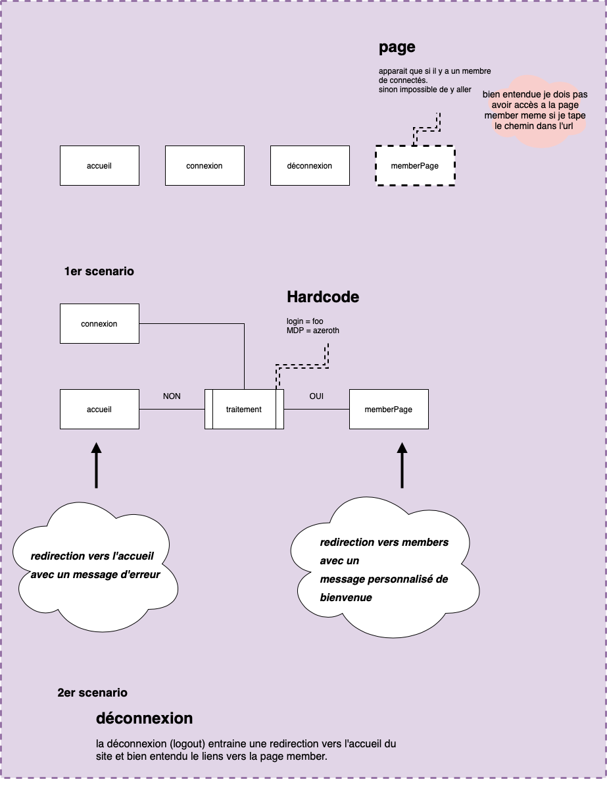
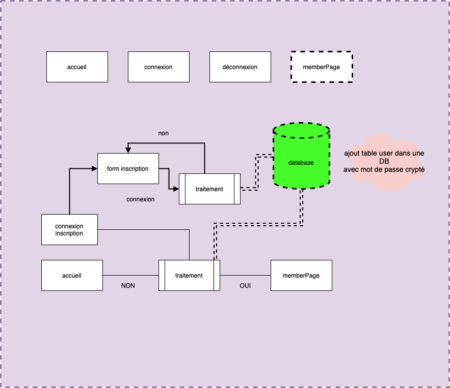

###member space 
*****

* en tant qu'utilisateur je vroudrais beneficier d'un espace membre

*****

exercice en deux phase :
* **1er phase** :
  (systeme et hardcode) une approche pour concevoir les mecanique du systeme... comment interdire et autoriser l'acces à un page, cacher ou pas une page dans la nav barre, le traitement de login en dure (login foo MDP azerty) etc...
  

* **2eme phase** :
   concevoir un table user, comment le MDP, s'assurer ou non de connexions (rendre le systeme avec un table dans la DB) "pas se soucier de mDP oublier"

****
##aide

phase 1

phase 2 
